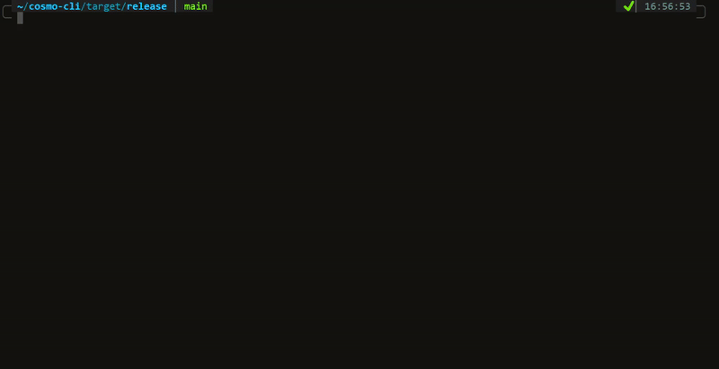

<br/>

The command-line interface tool that allows you to interact with the [Cosmo](https://cosmo.exein.io/) API. 

With the Cosmo CLI tool you are able to manage your projects, run scans, generate reports or manage your API keys to interface directly with the API.
For more info read the [docs](https://docs.exein.io/cosmo/get_started/cli).



## Build

Requires Rust version 1.59 or higher.
  
```bash
cargo build --release
```

## Usage 

| **Description**                                         | **Command**                                                                                                       |
| ------------------------------------------------------- | ----------------------------------------------------------------------------------------------------------------- |
| List personal projects                                  | `cosmo list`<br>`cosmo ls`                                                                                        |
| List personal projects (output in json)                 | `cosmo list --output json`                                                                                        |
| Create a new analysis [*](#supported-types)             | `cosmo create --file <FILE> --name <NAME> --type <TYPE> --subtype <SUBTYPE>`<br>`cosmo new --file <FILE> --name <NAME> --type <TYPE> --subtype <SUBTYPE>` |
| View project results overview                           | `cosmo overview --id <PROJECT_ID>` <br>`cosmo show --id <PROJECT_ID>`                                             |
| View analysis results[*](#supported-analysis)           | `cosmo analysis --id <PROJECT_ID> --analysis <ANALYSIS>`                                                          |
| View analysis results (output in json)                  | `cosmo analysis --id <PROJECT_ID> --analysis <ANALYSIS> --output json`                                                          |
| View paginated analysis results[*](#supported-analysis) | `cosmo analysis --id <PROJECT_ID> --analysis <ANALYSIS> --page 1 --per-page 10`                                   |
| Delete project                                          | `cosmo delete --id <PROJECT_ID>`<br>`cosmo rm --id <PROJECT_ID>`                                                  |
| Log out                                                 | `cosmo logout`                                                                                                    |
| Create an API key                                       | `cosmo apikey --action create`                                                                                    |
| List API key                                            | `cosmo apikey --action list`                                                                                      |
| Save PDF report                                         | `cosmo report --id <PROJECT_ID>`                                                                                  |
| List organizations                                      | `cosmo organization list`                                                                                         |
| Create an organization                                  | `cosmo organization create --name <NAME> --description <DESCRIPTION>`                                             |
| Delete an organization                                  | `cosmo organization delete --id <ORGANIZATION_ID>`                                             |


> **Note:** use `cosmo list` to retrieve a *<PROJECT_ID>* 


## Supported analysis

### Linux/Container Analysis
* hardening
* cve-check
* security-scan
* password-hash
* crypto
* nvram
* kernel
* software-bom
* static-code
### Container/Docker Lite Analysis
* cve-check
### UEFI Analysis
* access
* intel-boot-guard
* surface
* secure-boot
* uefi-security-scan
* peim-dxe
### Vxworks Analysis
* functions
* symbols
* tasks
* capabilities

## Supported types
| type | subtype |
| ---  | ---      |
| linux | generic |
| linux | yocto   |
| linux | buildroot | 
| linux | openwrt | 
| container | docker |
| container | docker-lite |
| container | lxc |
| uefi | generic |
| vxworks | generic |

## Contributing

To contribute to the project please refer to our [contribution guidelines](./CONTRIBUTING.md).

## License

Copyright (c) Exein SpA. All rights reserved.

Licensed under the [Apache License 2.0 license](./LICENSE).
